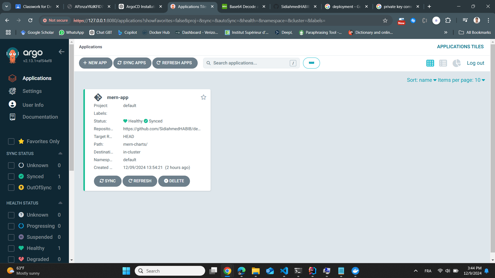

# TP5 : Déploiement d'Applications avec Helm Charts et ArgoCD

## Objectifs
- Créer des Helm Charts pour les services de l'application MERN (MongoDB, serveur, client).
- Configurer et déployer ArgoCD pour la gestion des déploiements.
- Automatiser le déploiement à partir d'un dépôt Git.

## Prérequis
- Kubernetes (Minikube ou Docker Desktop avec Kubernetes activé).
- Helm installé (v3+).
- kubectl configuré.
- Docker pour la construction des images.
- Compte GitHub.

## Structure du Projet
```
mern-charts/
|-- mongodb/
|   |-- charts/
|   |-- templates/
|   |-- values.yaml
|
|-- server/
|   |-- charts/
|   |-- templates/
|   |-- values.yaml
|
|-- client/
|   |-- charts/
|   |-- templates/
|   |-- values.yaml
```

### 2. Création des Charts Helm
1. MongoDB 
 `mongodb/values.yaml` :
```yaml
replicaCount: 1
image:
  repository: mongo
  tag: latest
service:
  port: 27017
```
2. Serveur 
`server/values.yaml` :
```yaml
replicaCount: 3
image:
  repository: sidiahmedhbb/mern-server
  tag: latest
service:
  port: 5000
```
3. Client 
 `client/values.yaml` :
```yaml
replicaCount: 3
image:
  repository: sidiahmedhbb/mern-client
  tag: latest
service:
  port: 3000
```

### 3. Hébergement des Charts
```bash
cd ../
git init
git add mern-charts/
git commit -m "Ajout des charts Helm"
git remote add origin [URL_DU_DEPOT_GIT]
git push -u origin main
```

### 4. Installation d'ArgoCD
```bash
kubectl create namespace argocd
kubectl apply -n argocd -f https://raw.githubusercontent.com/argoproj/argo-cd/stable/manifests/install.yaml
kubectl get pods -n argocd
```

### 5. Configuration et Accès ArgoCD
```bash
kubectl port-forward svc/argocd-server -n argocd 8080:443
kubectl -n argocd get secret argocd-initial-admin-secret -o jsonpath="{.data.password}" | base64 -d
```
Accéder à ArgoCD via `https://localhost:8080`

### 6. Déploiement avec ArgoCD
- Ajouter le dépôt Git dans `Settings > Repositories`
- Créer une nouvelle application :
  - Nom : `mern-app`
  - URL du dépôt Git
  - Path : `mern-charts/`
  - Cluster : `https://kubernetes.default.svc`

### 7. Synchronisation et Mises à Jour
- ArgoCD déploie automatiquement les modifications poussées sur Git.

### 8. Captures d’écran
 captures d’écran de l’interface ArgoCD montrant les applications
 synchronisées.
 


